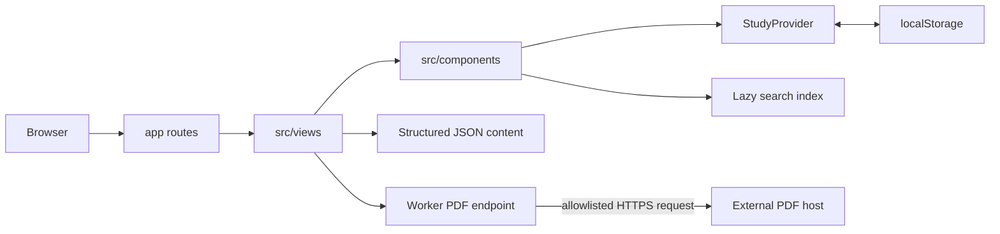

# Architecture

This document explains how CAIE A-Level Study Hub turns structured content into a routed study
experience. It is written both for contributors and for the project owner to use when explaining
the system.

## Design goals

- Make the main study flow usable without an account.
- Keep educational content separate from presentation code.
- Load detailed topic content and the search index only when needed.
- Keep copyrighted paper PDFs outside the repository.
- Make invalid content or unsafe PDF URLs fail during validation.
- Preserve a clear path from a classmate's request to an implemented and tested feature.

## System overview



The application is server-rendered through Vinext's Next-compatible routing and becomes a
Cloudflare Worker build. Most study interactions happen in React on the client. There is no account
database in version 1.

## Page-request workflow

Example: a student opens `/subject/9618/notes/13.2`.

1. `app/subject/[subject]/notes/[topic]/page.tsx` receives the route parameters.
2. The route renders `src/views/TopicPage.tsx`.
3. Subject and topic metadata are looked up through `src/data/subjects.ts`.
4. The note registry dynamically imports `src/data/notes/9618/13.2.json`.
5. Note components render definitions, sections, examples, visuals and exam guidance.
6. `StudyProvider` records the recently opened topic in browser state.
7. `PersistentHighlighter` rebuilds any saved text ranges for this topic.

If a topic has no detailed note file, the view creates a safe quick-guide page from its catalogue
summary and focus points.

## Content model

`src/data/subjects.json` is the catalogue. It defines four subjects, their syllabus units and 153
topic records. A topic record describes routing and discovery:

```json
{
  "id": "13.2",
  "title": "File organisation and access",
  "level": "A2",
  "levels": ["A2"],
  "summary": "A short catalogue description",
  "focusPoints": ["A key revision point"],
  "contentDepth": "full"
}
```

Detailed content lives in `src/data/notes/<subject-code>/<topic-id>.json`. These 104 files contain
data, not HTML strings, so the same content could later support another reader or export format.

`npm run data:build` reads the source catalogue and notes, then regenerates:

- `src/data/notes/registry.ts` for lazy note imports;
- `src/data/generated/search-index.json` for full-text search.

`npm run data:validate` checks subject codes, topic IDs, depth labels, note relationships, paper
records, HTTPS URLs and expected library totals.

## Search workflow

1. The user presses `/` or `Ctrl/Cmd + K`.
2. `GlobalSearch` opens the command dialog.
3. `src/utils/search.ts` imports the generated index only at that moment.
4. The browser scores matches across topic titles, summaries and note text.
5. Selecting a result routes directly to the subject or topic.

The lazy import keeps the first page smaller. Client-side ranking is simple and transparent, but it
is also a known scaling limit.

## Local study-state workflow

`src/hooks/use-study.tsx` owns one versioned state object:

```text
caie-study-hub:study-state:v1
```

It stores bookmarks, completed topics, syllabus checks, highlights, recent topics, the last opened
topic and theme preference. The provider:

1. reads and validates saved JSON after the app hydrates;
2. exposes typed actions through React context;
3. writes every accepted change back to `localStorage`;
4. listens for browser `storage` events so another tab stays in sync.

This design gives useful persistence with no account or database. Its trade-off is that clearing
browser data removes progress and different devices do not sync.

## Persistent highlighting workflow

The highlighter is the clearest example of feedback becoming architecture.

1. A student selects up to 1,500 characters inside a note.
2. The component records text offsets plus nearby prefix and suffix context.
3. `StudyProvider.addHighlight` stores the record under the topic key.
4. On a later visit, the component first checks the old offsets.
5. If note edits moved the text, it searches for the same text and surrounding context.
6. The CSS Custom Highlight API displays reconstructed ranges without injecting HTML.

Saved highlights can be reviewed, jumped to and deleted. The 100-highlight-per-topic limit prevents
unbounded local state.

## Past-paper workflow and security boundary

`src/data/papers/papers.json` contains metadata for 919 complete question-paper/mark-scheme pairs.
The PDFs themselves are not in Git.

1. Paper filters select metadata in the browser.
2. A preview request is sent to `/api/papers/pdf` with the external PDF URL.
3. `worker/index.ts` parses and validates that URL.
4. Only HTTPS URLs on the approved host and PDF paths are accepted.
5. The worker streams the response with defensive content headers.

The allowlist is important: without it, the endpoint could become an open proxy or be used to request
internal network resources.

## Analytics and privacy

Study state never goes to the analytics service. `GoogleAnalytics` waits for an explicit accept or
decline choice in the browser. The external script is inserted only after acceptance, and the choice
is saved separately from study progress. See [PRIVACY.md](PRIVACY.md).

## Build and delivery

`npm run build` asks Vinext/Vite to create a Cloudflare-compatible application in `dist/`. The
server entry exports a Worker `fetch` handler and the client directory contains static assets.

GitHub Actions runs content validation, linting, a production build and the test suite for every
pull request and push to `main`. The hosted site is deployed from a validated commit.

## Important trade-offs

| Decision | Benefit | Cost |
| --- | --- | --- |
| Structured JSON notes | Validatable and reusable content | More authoring ceremony |
| Browser-only study state | No accounts or student database | No cross-device sync |
| Lazy note/search imports | Smaller initial load | First search/topic can do extra work |
| External PDF metadata | Avoids committing copyrighted files | Depends on an external host |
| Allowlisted proxy | Safer previews and consistent headers | Only approved hosts work |
| Client-side search | Simple and inexpensive | Limited future scale |

## Where to make common changes

- Add a route: `app/`
- Change a whole screen: `src/views/`
- Change a reusable interface element: `src/components/`
- Revise syllabus metadata: `src/data/subjects.json`
- Revise one detailed note: `src/data/notes/<code>/`
- Change saved study behaviour: `src/hooks/use-study.tsx`
- Change PDF security rules: `worker/index.ts` and `tests/pdf-proxy.test.mjs`
- Change generated content rules: `scripts/` and related tests
