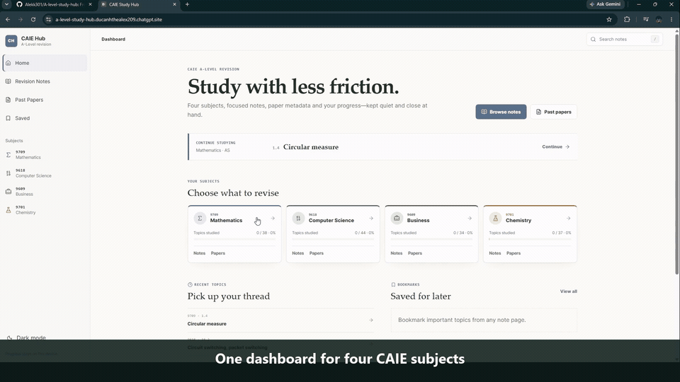

# CAIE A-Level Study Hub

A free revision platform created for my classmates and me. It brings structured notes, syllabus
progress, persistent highlights and a searchable past-paper catalogue into one responsive web app.

**Live site:** [a-level-study-hub.ducanhthealex209.chatgpt.site](https://a-level-study-hub.ducanhthealex209.chatgpt.site)

Created by **Đức Anh Lê (Alex Le)** · GitHub: [@Alekk301](https://github.com/Alekk301)

## Product demo



*A 23-second silent walkthrough. Captions are included in the recording.*

## Why I built it

Our revision material was spread across different sites, folders and document names. I wanted one
free place where my class could move from a syllabus topic to focused notes and then to the matching
question paper and mark scheme.

The project began as a small static site and developed into a routed React application after I
tested it with classmates, reviewed the usefulness of its notes and paper browser, and changed the
product around real feedback.

## Portfolio snapshot

| Evidence | Current result |
| --- | ---: |
| Supported CAIE A-Level subjects | 4 |
| Syllabus topics represented | 153 |
| Detailed structured note files | 104 |
| Searchable question-paper/mark-scheme pairs | 919 |
| Classmates who have opened the site | At least 10 |
| Automated checks | Content, search, state, routes, paper proxy and UI |

One classmate asked:

> “You should add the highlight function that can be stored until the next return, that would be great”

That request became persistent text highlighting: a student selects a useful passage, saves it, and
finds it restored on the same device during the next visit. The implementation is documented in
[the impact log](docs/IMPACT.md).

## What the product can do

- Browse Mathematics 9709, Computer Science 9618, Business 9609 and Chemistry 9701
- Read structured notes with definitions, examples, diagrams, exam tips and quick recall
- Search the complete topic and note index with `/` or `Ctrl/Cmd + K`
- Filter 919 paper pairs by subject, year, session and component
- Preview or download approved external PDFs without storing copyrighted papers in this repository
- Save bookmarks, progress, syllabus checks, highlights, recent topics and theme locally
- Use responsive desktop and mobile navigation, keyboard controls and accessible labels
- Load Google Analytics only after a visitor explicitly accepts optional analytics

## What this project demonstrates

- Turning a real student problem into a usable product
- Modelling educational content as validated, presentation-independent JSON
- Building reusable React components and refresh-safe dynamic routes
- Generating a lazy search index from source content
- Normalising a large paper catalogue and restricting the PDF proxy to approved hosts
- Persisting versioned browser state without requiring accounts
- Responding to user feedback with a traceable feature
- Testing data integrity, rendering, search, storage and worker behaviour
- Documenting design decisions, limitations, privacy and AI assistance honestly

## Technology

React 19, TypeScript, Vite 8, Vinext/Next-compatible routing, Cloudflare Workers, CSS, Node's test
runner and GitHub Actions.

## Repository map

| Path | Responsibility |
| --- | --- |
| `app/` | Routes, metadata, providers and top-level layout |
| `src/views/` | Route-level screens |
| `src/components/` | Layout, note, paper, search and analytics components |
| `src/data/subjects.json` | Subject, unit and topic catalogue |
| `src/data/notes/<code>/` | One structured JSON document per detailed topic |
| `src/data/papers/papers.json` | Normalised paper metadata |
| `src/data/generated/` | Generated lazy-search index |
| `src/hooks/use-study.tsx` | Versioned local study state |
| `worker/` | Allowlisted PDF preview proxy |
| `scripts/` | Content generation, import and validation |
| `tests/` | Automated project checks |

For the complete request and data flow, see [ARCHITECTURE.md](ARCHITECTURE.md). For a guided way to
learn the codebase, see [docs/LEARNING-GUIDE.md](docs/LEARNING-GUIDE.md).

## Run it locally

Requirements: Node.js 22.13 or newer and npm 10 or newer.

```bash
npm install
npm run dev
```

The same commands work on Windows, macOS and Linux.

## Verify it

```bash
npm run check
```

The full check validates the content, runs ESLint, creates a production build and runs the Node test
suite. Pull requests and pushes to `main` run the same checks in GitHub Actions.

## Content workflow

1. Edit topic metadata in `src/data/subjects.json`.
2. Add or revise a structured note in `src/data/notes/<subject-code>/`.
3. Run `npm run data:build` to regenerate the note registry and search index.
4. Run `npm run data:validate` to catch missing, mismatched or unsafe data.
5. Run `npm run check` before opening a pull request.

Generated registry and search files should not be edited by hand.

## Project documentation

- [Architecture and workflows](ARCHITECTURE.md)
- [How to learn the codebase](docs/LEARNING-GUIDE.md)
- [AI assistance and authorship](docs/AI-USAGE.md)
- [Impact and user feedback](docs/IMPACT.md)
- [Decision log](docs/DECISIONS.md)
- [Demo recording guide](docs/DEMO-SCRIPT.md)
- [Contributing guide](CONTRIBUTING.md)
- [Privacy](PRIVACY.md)
- [Security policy](SECURITY.md)
- [Credits and source policy](CREDITS.md)

## Honest AI disclosure

I used ChatGPT, Codex and Claude throughout the project. I estimate that AI generated or
substantially assisted **60–70% of the code and educational content**. I am not presenting that work
as unaided programming.

My contribution is the problem selection, intended audience, product direction, information
structure, feature priorities, paper-library challenge, evaluation of note relevance, testing of
the paper browser, feedback collection and the responsibility to understand and verify what ships.
The exact boundary is recorded in [docs/AI-USAGE.md](docs/AI-USAGE.md).

## Current limitations

- Study progress is tied to one browser and does not sync between devices.
- Some topics are quick guides rather than full notes.
- The paper catalogue currently covers archive years through 2025.
- Search is client-side and will need another design if the content grows substantially.
- Educational content is revision support, not an official Cambridge resource.
- The “at least 10 classmates” figure is a verified minimum; analytics totals will be added only
  after a dated export is reviewed.

## Copyright and licences

Past-paper PDFs are not committed to this repository. The app organises metadata and proxies
approved previews from an external host. It is not affiliated with or endorsed by Cambridge
International.

Source code is licensed under the [MIT License](LICENSE). Original educational content is licensed
under [CC BY-NC-SA 4.0](CONTENT-LICENSE.md). Cambridge materials, external PDFs, third-party
trademarks and credited diagrams are excluded and remain under their respective owners' terms.
